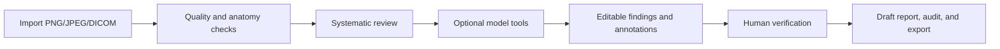
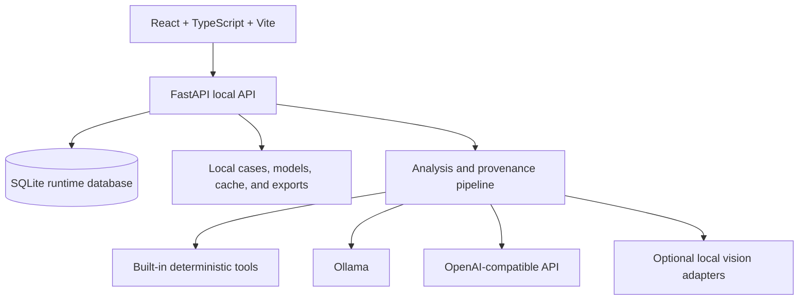

# MedRay v2

<p align="center">
  
</p>

<p align="center"><strong>A local-first workspace for structured X-ray review, AI-assisted reporting, annotations, and model evaluation.</strong></p>

<p align="center">
  
  
  
  
  
</p>

> [!CAUTION]
> MedRay v2 is research, education, and prototyping software. It is not a medical device, diagnostic system, PACS, RIS, or emergency-triage tool. AI output may be incomplete, incorrect, or misleading and must be independently reviewed by a qualified clinician. Never use it for autonomous clinical decisions or real patient care without the required institutional approvals and validation.

## Overview

MedRay v2 is a local application for reviewing plain radiographs and experimenting with traceable AI-assisted workflows. It combines an X-ray viewer, structured reading templates, anatomy routing, editable annotations, report drafting, case management, model discovery, and validation utilities in one workspace.

The default **Built-in Demo** works without downloading a clinical model. Optional local runtimes can be connected when you want to test a model on your own machine. Data is stored locally by default; cloud access is disabled unless explicitly configured and permitted by the runtime safety checks.

The interface starts in English for new users. Indonesian is also available from the language control and is remembered locally in the browser.

## What is implemented

| Area | Current capability |
| --- | --- |
| Reading Room | Import PNG, JPEG, and DICOM studies; zoom, brightness, contrast, metadata, multi-image navigation, and overlays |
| Anatomy routing | Chest, MSK/trauma, abdomen/KUB, spine, skull/facial/sinus, and general/unknown profiles; DICOM metadata, study description, filename, and reviewer override are supported inputs |
| Structured review | Image-quality estimate, anatomy-specific checklists, laterality/view warnings, findings, differentials, result cards, provenance, and human-review state |
| Annotations | Manual and model-originated annotations with editable geometry, source-image links, finding links, revision history, and reviewed PNG/JSON packages |
| Reporting | English or Indonesian draft reports with Markdown, PDF, JSON, annotated PNG, and audit-bundle export |
| Case Library | Local SQLite-backed case storage, multiple images per study, search, configurable database folder, and explicit deletion controls |
| DICOM safety | Local tag inspection, private/burned-in risk warnings, prototype de-identification, readback verification, and de-identified metadata/DICOM export |
| Model Finder | Search and inspect Hugging Face, GitHub, and installed Ollama models; import local artifacts; queue direct downloads; save local model cards |
| Validation Workbench | Curated fixtures, reviewer labels, dataset/protocol metadata, agreement metrics, missed-reference review, and validation-report export |
| Runtime connections | Built-in deterministic demo, Ollama, and OpenAI-compatible chat endpoints; optional local vision adapters |

## Typical workflow



MedRay keeps the reviewer in control. A fallback visual guide is explicitly labeled as a general review region, not as pathology localization. Model-generated boxes, labels, probabilities, and text remain candidate research outputs until they have appropriate local evidence and human review.

## Architecture



- **Frontend:** React 19, TypeScript, Vite, Vitest, and Lucide icons.
- **Backend:** Python, FastAPI, Pydantic Settings, Pillow, pydicom, ReportLab, and pytest.
- **Storage:** local filesystem plus SQLite; runtime data is intentionally excluded from Git.
- **Model boundary:** optional model packages and weights are installed separately. A model is not enabled for analysis merely because it was downloaded; local model-card review and validation gates still apply.

## Model and runtime support

| Runtime or adapter | Supported use | Status and boundary |
| --- | --- | --- |
| Built-in Demo | Explore the complete UI and deterministic review flow | Available by default; not a clinical AI model |
| Ollama | Local chat, image review with a VLM, and selected report drafting paths | Available when Ollama and a compatible model are installed; outputs are unvalidated candidate observations |
| OpenAI-compatible API | Chat through a configured compatible endpoint | Optional; endpoint use is subject to local/cloud safety settings |
| TorchXRayVision DenseNet-121 | Optional multi-label CXR classification | Adapter is wired; install optional dependencies and treat probabilities as research-only |
| Reviewed local Ultralytics detector | Optional MSK fracture bounding-box localization | Requires an imported local artifact, a completed model card, and box-level local validation |
| MedRAX-inspired tool interface | Composable tool contracts and provenance-oriented orchestration boundary | The repository does not bundle the external MedRAX model stack or weights |
| LocateAnything parser | Parse bounded box/point/`none` outputs into MedRay annotation objects | Research parser only; model download, remote-code execution, and automatic inference are intentionally not enabled |

## Quick start

### Requirements

- Python 3.10 or newer (Python 3.12 is tested in this workspace).
- Node.js 20 LTS or 22 LTS. Node.js 21 is not an LTS target for the frontend toolchain.
- npm.
- Windows 10/11, Linux, or macOS.
- Optional: Ollama for local chat/VLM workflows; a suitable PyTorch installation for optional vision adapters.

### Windows

From the repository root:

```powershell
.\start_medray_v2.bat
```

The launcher creates `.env` and `.venv` when needed, installs core dependencies, starts the FastAPI backend and Vite frontend, and prints the local URLs. Open the displayed frontend URL, normally:

```text
http://127.0.0.1:5173
```

The backend API and interactive OpenAPI documentation are normally available at:

```text
http://127.0.0.1:8765/api/health
http://127.0.0.1:8765/docs
```

Close the launcher with `Ctrl+C`. If an older process still owns a port, run:

```powershell
.\stop_medray_v2.bat
```

### Linux or macOS

```bash
chmod +x start_medray_v2.sh
./start_medray_v2.sh
```

Then open `http://127.0.0.1:5173` in a browser. Stop the processes with `Ctrl+C`.

## Optional model dependencies

The core application does not require PyTorch, Transformers, or model weights. Install the optional stack only when you are testing the corresponding adapters:

```powershell
.\scripts\setup_windows.ps1 -WithOptional
```

```bash
MEDRAY_INSTALL_OPTIONAL=1 ./scripts/setup_unix.sh
```

For local Ollama chat, install and start Ollama separately, then pull a model available on your machine. For example:

```bash
ollama pull qwen2.5:3b
```

For local image review, use a compatible vision model and select it in **Runtime Settings**. Model names and hardware requirements vary by Ollama version and model package; the example is not a clinical recommendation.

## Manual development setup

### Windows PowerShell

```powershell
py -3 -m venv .venv
.\.venv\Scripts\Activate.ps1
python -m pip install --upgrade pip
python -m pip install -r backend\requirements.txt

cd frontend
npm ci
npm run dev
```

In a second terminal, from the repository root with the virtual environment active:

```powershell
python -m uvicorn app.main:app --app-dir backend --host 127.0.0.1 --port 8765
```

### Linux or macOS

```bash
python3 -m venv .venv
source .venv/bin/activate
python -m pip install --upgrade pip
python -m pip install -r backend/requirements.txt

cd frontend
npm ci
npm run dev
```

In a second terminal, from the repository root with the virtual environment active:

```bash
python -m uvicorn app.main:app --app-dir backend --host 127.0.0.1 --port 8765
```

The frontend falls back to `http://127.0.0.1:8765/api` when `VITE_API_BASE` is not set. If the backend uses another port, set `VITE_API_BASE` before starting Vite.

## Configuration

Copy `.env.example` to `.env` only when custom settings are needed. Never commit `.env`, API keys, tokens, patient identifiers, DICOM files, or model weights.

| Variable | Purpose | Default |
| --- | --- | --- |
| `MEDRAY_HOST` | Backend bind address; keep loopback unless authentication and hardening are added | `127.0.0.1` |
| `MEDRAY_PORT` | Preferred backend port | `8765` |
| `MEDRAY_DATA_DIR` | Root folder for cases, models, cache, exports, and the default SQLite database | `./data` |
| `MEDRAY_DEFAULT_BACKEND` | Initial primary runtime | `demo` |
| `MEDRAY_OLLAMA_BASE_URL` | Ollama endpoint | `http://127.0.0.1:11434` |
| `MEDRAY_OPENAI_BASE_URL` | OpenAI-compatible endpoint | `http://127.0.0.1:8000/v1` |
| `MEDRAY_OPENAI_API_KEY` | Optional compatible API credential | empty |
| `VITE_API_BASE` | Frontend API base for manual Vite development | `http://127.0.0.1:8765/api` |

The UI can also move the SQLite database to a user-selected folder. It refuses to overwrite an existing database and requires a restart to activate a newly selected path.

## Testing and build

Run the backend tests from the repository root:

```powershell
.\.venv\Scripts\python.exe -m pytest backend/tests
```

Run the frontend tests and production build:

```bash
cd frontend
npm test -- --run
npm run build
```

The current verified baseline in this workspace is:

- Backend: **141 passed, 1 skipped**.
- Frontend: **14 passed**.
- Production frontend build: **passed**.

External model availability, Ollama behavior, hardware performance, and clinical validity are not established by these tests.

## Data, privacy, and security

Runtime data is excluded from Git, including:

- uploaded cases, images, and DICOM files;
- SQLite databases and generated reports/exports;
- downloaded model files and local model registries;
- caches, virtual environments, build output, logs, and credentials.

Use synthetic or properly de-identified images for development and issue reports. The DICOM helpers are a local prototype, not a certification of DICOM PS3.15 compliance. They do not remove identifying information burned into pixels, and every export must be reviewed before sharing.

By default the server is loopback-only. Do not expose it to an untrusted network. Read [SECURITY.md](SECURITY.md), [DISCLAIMER.md](DISCLAIMER.md), and [the safety guide](docs/SAFETY.md) before connecting external services or real clinical data.

## Repository layout

```text
backend/app/             FastAPI app, analysis pipeline, storage, adapters, and schemas
backend/tests/           Backend unit and API tests
frontend/src/            React UI, API client, types, annotation geometry, and styles
frontend/public/         Logo and static assets
data/                    Empty runtime directories retained with .gitkeep
docs/                    Architecture, safety, model, validation, and roadmap documentation
wiki/                    Ready-to-publish GitHub Wiki pages
scripts/                 Cross-platform setup and Windows process helpers
.github/                 CI, Dependabot, issue, and pull-request configuration
CHANGELOG.md             Release history and current alpha status
CODE_OF_CONDUCT.md       Community participation guidelines
```

## Documentation

- [Documentation index](docs/README.md)
- [Architecture](docs/ARCHITECTURE.md)
- [Safety and operating limits](docs/SAFETY.md)
- [Troubleshooting](docs/TROUBLESHOOTING.md)
- [Model Finder](docs/MODEL_FINDER.md)
- [Validation Workbench](docs/VALIDATION_WORKBENCH.md)
- [DICOM and annotation direction](docs/XRAY_ANNOTATION_DIRECTION.md)
- [First real vision model](docs/FIRST_REAL_VISION_MODEL.md)
- [MSK localization pilot](docs/MSK_LOCALIZATION_PILOT.md)
- [LocateAnything evaluation](docs/LOCATE_ANYTHING_EVALUATION.md)
- [MedRAX adapter boundary](docs/MEDRAX_ADAPTER.md)
- [Roadmap](docs/ROADMAP.md)
- [Wiki source and publishing guide](wiki/README.md)

## Project status and known limits

MedRay v2 is an **alpha research prototype**. The review UI, case library, reporting/export paths, model discovery, runtime settings, provenance structures, anatomy routing, and validation workbench are implemented and covered by automated tests.

The following boundaries are intentional:

- the Built-in Demo is deterministic scaffolding, not a trained clinical model;
- external model outputs are not automatically treated as diagnoses;
- generic or unknown anatomy is not sent to an anatomy-specific model until confirmed;
- downloaded or imported models stay inactive until the local model-card gate is satisfied;
- segmentation and general-purpose grounding are not enabled as clinically validated capabilities;
- DICOMweb is not implemented; DICOM handling is local file ingestion and export;
- no production authentication, authorization, multi-tenant isolation, or internet-facing hardening is provided.

## Contributing

Please read [CONTRIBUTING.md](CONTRIBUTING.md) and [CODE_OF_CONDUCT.md](CODE_OF_CONDUCT.md) before opening a pull request. Contributions should include focused tests and must not include patient data, credentials, model weights, or generated runtime files.

## References and credits

MedRay v2 is an original local-first implementation. Its workflow and integration boundaries were informed by:

- [MedRAX](https://github.com/bowang-lab/MedRAX) — a tool-oriented medical reasoning agent for chest X-ray workflows.
- [TorchXRayVision](https://github.com/mlmed/torchxrayvision) — open-source chest X-ray datasets and pretrained model interfaces.
- [FastAPI documentation](https://fastapi.tiangolo.com/) — backend API framework reference.
- [Vite documentation](https://vite.dev/guide/) — frontend development and build reference.
- [MedRay Workspace v1](https://github.com/Halo1211/medray-workspace) — archived predecessor and conceptual reference.
- [Odysseus](https://github.com/pewdiepie-archdaemon/odysseus) — project reference.

See [docs/CREDITS.md](docs/CREDITS.md) for the project-level attribution note. MedRay v2's logo is a new geometric design and does not reuse the v1 artwork.

## License

MedRay v2 is released under the [MIT License](LICENSE). The license applies to the project source code and documentation. Medical datasets, model weights, third-party libraries, and external services may have separate terms; review their licenses before redistribution or deployment.
