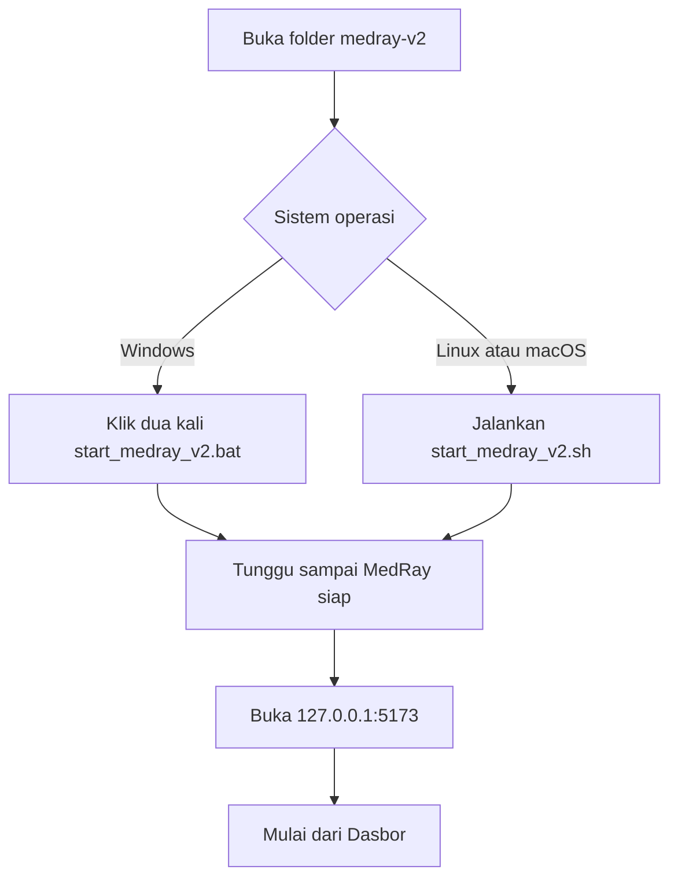
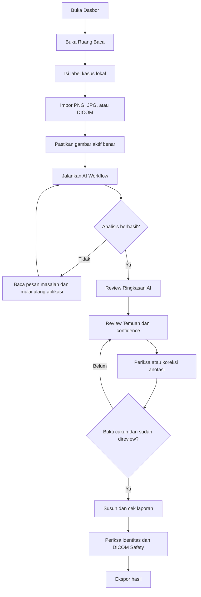

# Rombak GUI dan Flow Penggunaan MedRay v2

Dokumen ini merangkum dasar desain GUI baru, cara setup, dan cara menggunakan MedRay v2. MedRay tetap merupakan aplikasi riset, edukasi, dan prototyping; bukan alat diagnosis klinis resmi.

## Tujuan desain

GUI baru mengutamakan satu jalur kerja utama:

`Impor studi -> Jalankan analisis -> Review bukti -> Laporan dan ekspor`

Perubahan utama:

1. Navigasi dipisahkan menjadi **Alur utama** dan **Alat lanjutan**.
2. Dasbor berfungsi sebagai halaman mulai, bukan kumpulan metrik tanpa tindakan berikutnya.
3. Ruang Baca memiliki indikator progres empat langkah dan aksi primer yang jelas.
4. Profil anatomi, prompt khusus, metadata, dan pengaturan gambar memakai progressive disclosure.
5. Empat tab review utama dipisahkan dari AI Chat, Trust, DICOM Safety, dan Roadmap.
6. Status tidak hanya mengandalkan warna; status selalu disertai teks atau ikon.
7. Fokus keyboard dibuat terlihat dan ukuran kontrol utama diperbesar.

## Dasar penelusuran online

- FDA menempatkan pengguna, lingkungan penggunaan, dan user interface sebagai tiga komponen utama sistem perangkat-pengguna. Tujuan human factors adalah mengurangi use error dan memastikan penggunaan yang aman dan efektif: <https://www.fda.gov/medical-devices/human-factors-and-medical-devices/human-factors-considerations>
- FDA juga memasukkan setup, display, controls, labeling, dan training material sebagai bagian user interface, sehingga panduan setup harus diperlakukan sebagai bagian dari desain: <https://www.fda.gov/medical-devices/device-advice-comprehensive-regulatory-assistance/human-factors-and-medical-devices>
- WCAG 2.2 mewajibkan navigasi yang dapat dipahami, urutan fokus yang logis, focus visible, target minimum, serta identifikasi error: <https://www.w3.org/TR/WCAG22/>
- GOV.UK Task List menunjukkan tugas, status selesai/belum, dan tindakan berikutnya secara ringkas. Pola ini menjadi dasar stepper MedRay: <https://design-system.service.gov.uk/components/task-list/>
- GOV.UK Check Answers menekankan review sebelum submit/export dan kemampuan kembali memperbaiki data tanpa kehilangan isi: <https://design-system.service.gov.uk/patterns/check-answers/>
- W3C Cognitive Accessibility menekankan kontrol konvensional, tujuan yang jelas, label/header, konsistensi visual, dan hubungan yang jelas antara kontrol dan kontennya: <https://www.w3.org/WAI/WCAG2/supplemental/objectives/o1-understandable/>
- GOV.UK menyarankan memulai dengan satu hal per halaman karena membantu fokus, pemahaman, penggunaan mobile, dan pemulihan dari error: <https://www.gov.uk/service-manual/design/form-structure>
- Microsoft progressive disclosure mempertahankan status penting tetap terlihat sambil menampilkan detail teknis hanya ketika diminta: <https://learn.microsoft.com/en-us/windows/win32/uxguide/ctrl-progressive-disclosure-controls>

Pedoman tersebut adalah referensi desain, bukan klaim kepatuhan regulatori atau pengganti usability validation formal.

## Implementasi simplifikasi 25 Agustus 2026

- Navigasi harian tetap terlihat; empat alat lanjutan berada di satu disclosure.
- Dashboard berubah dari empat kartu penjelasan besar menjadi satu status alur ringkas.
- Runtime Settings berubah dari satu halaman teknis panjang menjadi empat tab konten nyata.
- Setup pertama kali, metadata Validasi, direct download, dan katalog riset menggunakan progressive disclosure.
- Library menggunakan batch 15 kasus dan bulk-delete tidak lagi menjadi aksi persisten.
- Empty state Ruang Baca hanya menunjukkan tindakan berikutnya; kontrol image dan hasil tampil setelah konteks tersedia.

## Flowchart setup



### Setup Windows

```powershell
.\start_medray_v2.bat
```

### Setup Linux atau macOS

```bash
cd medray-v2
./start_medray_v2.sh
```

Launcher menjalankan setup otomatis bila komponen belum tersedia. MedRay dapat langsung dipakai dalam mode bawaan; model AI tambahan hanya perlu dipasang bila memang dibutuhkan.

## Flowchart penggunaan



## Checklist penggunaan aman

- Pastikan label kasus dan gambar aktif sesuai sebelum analisis.
- Gunakan `Auto route` kecuali routing anatomi salah.
- Bedakan panduan umum, hasil model tambahan, dan hasil yang sudah direview manusia.
- Jangan memasukkan temuan yang belum direview ke laporan final.
- Periksa sumber, confidence, uncertainty, dan bukti anotasi.
- Untuk DICOM, periksa patient tags, private tags, burned-in pixels, dan acknowledgement sebelum ekspor.
- Verifikasi seluruh output dengan radiolog/dokter.

## Uji usability yang disarankan

Lakukan pengujian dengan pengguna representatif dan tugas nyata berikut:

1. Setup dan buka aplikasi tanpa bantuan developer.
2. Impor satu studi multi-image.
3. Temukan tombol analisis dan jalankan workflow.
4. Jelaskan model/sumber hasil, status review, dan gambar aktif.
5. Koreksi satu anotasi dan review satu temuan.
6. Buat laporan dan hentikan ekspor DICOM berisiko.

Catat completion rate, waktu penyelesaian, salah klik, kebutuhan bantuan, near miss, dan skor SUS. GUI baru tetap perlu diuji; implementasi pola yang baik bukan bukti bahwa antarmuka sudah tervalidasi.
