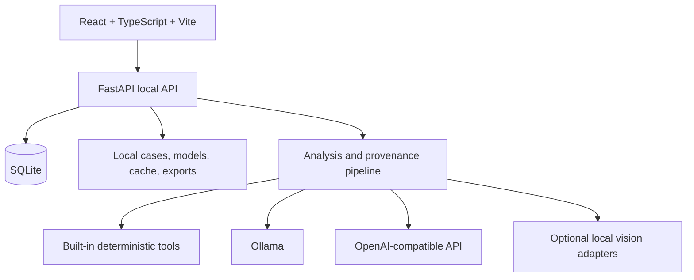

# Architecture

## Frontend

The React frontend is in `frontend/src`. It owns navigation, reading-room interaction, annotation geometry, report editing, runtime settings, and the API client. Vite builds the production bundle and Vitest runs frontend tests.

## Backend

The FastAPI backend is in `backend/app` and exposes routes under `/api`. Major boundaries include:

- `api/routes.py`: HTTP API and request validation.
- `pipelines/analysis_pipeline.py`: quality, routing, model calls, findings, result cards, differential assistance, report construction, and trace output.
- `anatomy/router.py`: anatomy profiles, laterality/view extraction, routing confidence, and model-slot resolution.
- `storage/db.py`: SQLite persistence and path-safe case storage.
- `dicom/safety.py`: local DICOM tag review and prototype de-identification.
- `annotations/exporter.py` and `audit/bundle.py`: review and audit exports.
- `model_finder/` and `model_registry/`: discovery, local artifacts, model cards, downloads, and validation evidence.
- `vision/`: optional TorchXRayVision and local Ultralytics adapter boundaries.

## Storage

The default data root is `data/`. Runtime cases, models, cache, exports, temporary files, and the SQLite database are excluded from Git. A user can configure the database folder through the UI or `MEDRAY_DATA_DIR` for the default data root.

## Safety boundary

The server is loopback-only by default. Model downloads do not automatically enable inference. Runtime selection is gated by model-card and validation evidence where applicable. Read [Safety and Privacy](Safety-and-Privacy.md) before using external endpoints or real data.
